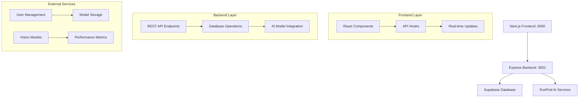
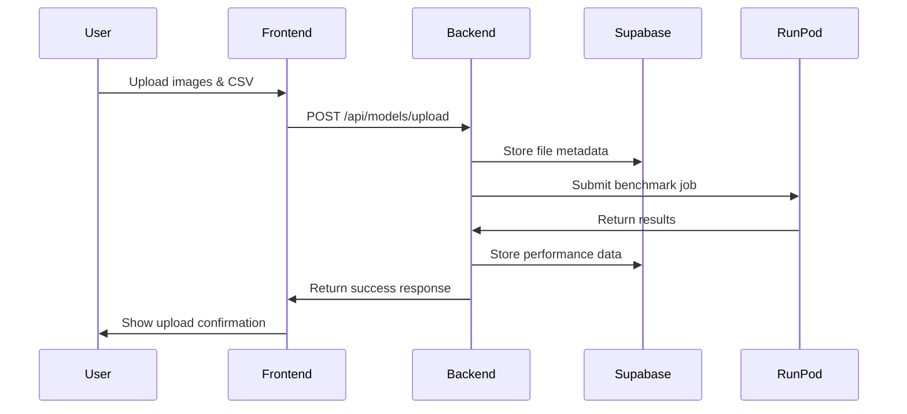
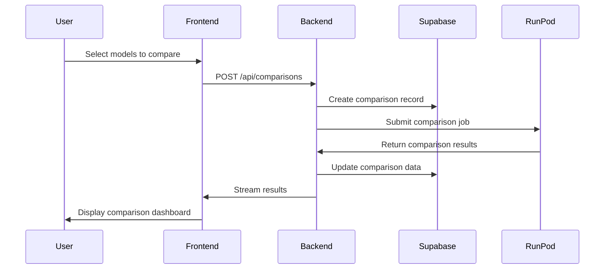

# ComparaVision Integration Guide

## 🚀 Full-Stack Integration Overview

This guide explains how the Next.js frontend and Express.js backend are integrated and how to deploy the complete system.

## 📋 System Architecture



## 🔗 Integration Points

### 1. API Communication
- **Frontend**: Uses `src/lib/api.ts` for all backend communication
- **Backend**: Provides RESTful endpoints at `/api/*`
- **Protocol**: HTTP/HTTPS with JSON payloads
- **Authentication**: Bearer token in Authorization header

### 2. Real-time Updates
- **WebSocket**: For live dashboard updates
- **Polling**: For status checks and metrics
- **Supabase**: Real-time database subscriptions

### 3. File Upload
- **Frontend**: Drag-and-drop interface with progress tracking
- **Backend**: Multipart form data handling
- **Storage**: Supabase storage buckets

## 🛠️ Development Setup

### Prerequisites
- Node.js 18+ 
- npm 8+
- Git
- Docker (optional)

### Quick Start

1. **Clone and Install**
```bash
git clone <repository-url>
cd comparavision-integration
npm run install:all
```

2. **Configure Environment**
```bash
# Copy environment templates
cp backend/env backend/env.local
cp frontend/env.local frontend/env.local.example

# Edit the files with your credentials
nano backend/env.local
nano frontend/env.local
```

3. **Start Development**
```bash
# Start both frontend and backend
npm run dev

# Or use the deployment script
./deploy.sh --full
```

## 🔧 Environment Configuration

### Frontend Environment (`frontend/env.local`)
```properties
# Backend Connection
NEXT_PUBLIC_BACKEND_URL=http://localhost:3001

# Supabase Configuration
NEXT_PUBLIC_SUPABASE_URL=your_supabase_url_here
NEXT_PUBLIC_SUPABASE_ANON_KEY=your_supabase_anon_key_here

# RunPod Configuration
NEXT_PUBLIC_RUNPOD_API_KEY=your_runpod_api_key_here
NEXT_PUBLIC_RUNPOD_ENDPOINT_ID=your_runpod_endpoint_id_here

# Development Settings
NODE_ENV=development
NEXT_PUBLIC_APP_ENV=development
```

### Backend Environment (`backend/env`)
```properties
# Server Configuration
PORT=3001
NODE_ENV=development

# Supabase Configuration
REACT_APP_SUPABASE_URL=your_supabase_url_here
REACT_APP_SUPABASE_ANON_KEY=your_supabase_anon_key_here

# RunPod Configuration
RUNPOD_API_KEY=your_runpod_api_key_here
RUNPOD_ENDPOINT_ID=your_runpod_endpoint_id_here

# CORS Configuration
CORS_ORIGIN=http://localhost:3000

# Database Configuration
DATABASE_URL=your_database_url_here
```

## 🚀 Deployment Options

### 1. Local Development
```bash
# Install dependencies
npm run install:all

# Start development servers
npm run dev

# Access the application
# Frontend: http://localhost:3000
# Backend: http://localhost:3001
```

### 2. Docker Deployment
```bash
# Build and start with Docker
docker-compose up --build -d

# Or use the deployment script
./deploy.sh --docker
```

### 3. Production Deployment
```bash
# Build for production
npm run build

# Start production servers
npm run start:backend
npm run start:frontend
```

## 📊 API Endpoints

### Authentication
- `POST /api/auth/register` - Register new user
- `GET /api/auth/user/:auth0_id` - Get user profile
- `PUT /api/auth/user/:auth0_id` - Update user profile
- `POST /api/auth/sync` - Sync user data

### Model Management
- `POST /api/models/upload` - Upload AI model
- `GET /api/models/user/:userId` - Get user models

### Comparisons
- `POST /api/comparisons` - Create model comparison
- `GET /api/comparisons/:comparisonId` - Get comparison results
- `GET /api/comparisons/user/:userId` - Get user comparisons

### Metrics
- `GET /api/metrics/system` - System performance metrics
- `GET /api/metrics/enterprise/:organizationId` - Enterprise metrics

### Health Checks
- `GET /health` - Backend health status
- `GET /test-db` - Database connection test

## 🔄 Data Flow

### 1. User Upload Flow


### 2. Model Comparison Flow


## 🐛 Troubleshooting

### Common Issues

1. **CORS Errors**
   - Check `CORS_ORIGIN` in backend environment
   - Ensure frontend URL matches backend CORS settings

2. **Database Connection Issues**
   - Verify Supabase credentials
   - Check network connectivity
   - Test with `/test-db` endpoint

3. **Port Conflicts**
   - Frontend: 3000, Backend: 3001
   - Use `lsof -i :3000` to check port usage
   - Kill processes if needed: `kill -9 <PID>`

4. **Build Errors**
   - Clear node_modules: `npm run clean`
   - Reinstall dependencies: `npm run install:all`
   - Check Node.js version: `node --version`

### Debug Commands
```bash
# Check backend health
curl http://localhost:3001/health

# Test database connection
curl http://localhost:3001/test-db

# Check frontend build
cd frontend && npm run build

# View logs
docker-compose logs -f
```

## 📈 Performance Optimization

### Frontend
- Code splitting with Next.js
- Image optimization
- Lazy loading components
- Memoization with React.memo

### Backend
- Connection pooling
- Request caching
- Rate limiting
- Compression middleware

### Database
- Indexed queries
- Connection pooling
- Query optimization
- Real-time subscriptions

## 🔒 Security Considerations

### Authentication
- JWT token validation
- Auth0 integration
- Session management
- CSRF protection

### Data Protection
- Input validation
- SQL injection prevention
- XSS protection
- File upload validation

### API Security
- Rate limiting
- CORS configuration
- HTTPS enforcement
- API key management

## 📚 Additional Resources

- [Next.js Documentation](https://nextjs.org/docs)
- [Express.js Guide](https://expressjs.com/)
- [Supabase Documentation](https://supabase.com/docs)
- [RunPod API Reference](https://runpod.io/docs/api)
- [Docker Compose Reference](https://docs.docker.com/compose/)

## 🤝 Contributing

1. Fork the repository
2. Create a feature branch
3. Make your changes
4. Test thoroughly
5. Submit a pull request

## 📞 Support

For technical support:
- Check the troubleshooting section
- Review the logs
- Create an issue on GitHub
- Contact the development team 