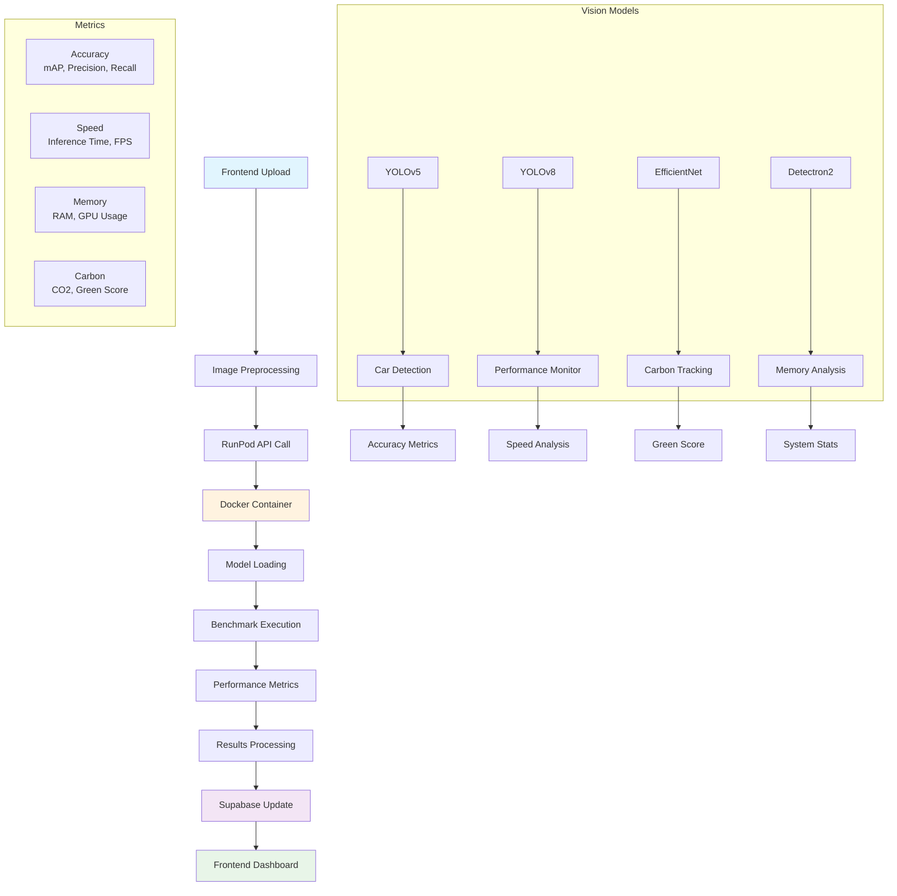

# ComparaVision (Beta Integration)

> **Vision Model Performance Comparison Platform - Empowering Sustainable AI Decisions**

Contributors: Igo Domingo, Nhi Ngo, Varun Patel, McCauley Armishaw

ComparaVision is a platform that empowers users to compare the performance, speed, memory usage, and other key metrics of vision models. It's designed for enterprises and businesses that need to make data-driven decisions about deploying vision language models (VLMs) and other computer vision solutions.


## 🎬 Demo Video

[](https://youtu.be/4153oSQKyLQ)


## 🌱 Green AI: Sustainability at the Core

A core mission of ComparaVision is to make AI adoption more sustainable. Every model comparison includes detailed carbon footprint analysis, energy consumption metrics, and a "Green Score" to help users understand the environmental impact of their AI choices. By surfacing these insights, we enable organizations to choose not just the most accurate or cost-effective model, but also the most eco-friendly—helping reduce the carbon footprint of AI and contribute to a healthier planet.

---

## 🚀 Quick Start

```bash
# Clone the repository
git clone <repository-url>
cd comparavision-integration

# Install dependencies
npm run install:all

# Start development servers
npm run dev

# Access the application
# Frontend: http://localhost:3000
# Backend: http://localhost:3001
```

## 🔧 Environment Setup

**Frontend** (`frontend/env.local`):
```properties
NEXT_PUBLIC_BACKEND_URL=http://localhost:3001
NEXT_PUBLIC_SUPABASE_URL=your_supabase_url_here
NEXT_PUBLIC_SUPABASE_ANON_KEY=your_supabase_anon_key_here
NEXT_PUBLIC_RUNPOD_API_KEY=your_runpod_api_key_here
NEXT_PUBLIC_RUNPOD_ENDPOINT_ID=your_runpod_endpoint_id_here
```

**Backend** (`backend/env`):
```properties
PORT=3001
REACT_APP_SUPABASE_URL=your_supabase_url_here
REACT_APP_SUPABASE_ANON_KEY=your_supabase_anon_key_here
RUNPOD_API_KEY=your_runpod_api_key_here
RUNPOD_ENDPOINT_ID=your_runpod_endpoint_id_here
CORS_ORIGIN=http://localhost:3000
```

## 🏗️ System Architecture



## 📊 Performance Metrics

### 🎯 Accuracy Metrics
- **mAP (Mean Average Precision)**: Overall detection accuracy
- **Precision**: True positives / (True positives + False positives)
- **Recall**: True positives / (True positives + False negatives)
- **F1 Score**: Harmonic mean of precision and recall

### ⚡ Speed Metrics
- **Inference Time**: Time per image processing (ms)
- **Throughput**: Images processed per second (FPS)
- **Latency**: End-to-end response time
- **P95 Latency**: 95th percentile response time

### 💾 Memory Metrics
- **RAM Usage**: System memory consumption (MB)
- **GPU Memory**: CUDA memory utilization (MB)
- **Peak Memory**: Maximum memory during processing

### 🌱 Environmental Metrics
- **CO2 Emissions**: Carbon footprint per inference (kg)
- **Green Score**: Environmental efficiency rating (1-10)
- **Energy Consumption**: Power usage during processing

## 🚀 Deployment Options

### Local Development
```bash
# Install dependencies
npm run install:all

# Start development servers
npm run dev

# Access the application
# Frontend: http://localhost:3000
# Backend: http://localhost:3001
```

### Docker Deployment
```bash
# Build and start with Docker
docker-compose up --build -d

# Or use the deployment script
./deploy.sh --docker
```

### Production Deployment
```bash
# Build for production
npm run build

# Start production servers
npm run start:backend
npm run start:frontend
```

## 📡 API Endpoints

### Health & Status
- `GET /health` - Health check
- `GET /test-db` - Database connection test

### Authentication
- `POST /api/auth/register` - User registration
- `GET /api/auth/user/:id` - Get user profile
- `PUT /api/auth/user/:id` - Update user profile
- `POST /api/auth/sync` - Sync user data

### Model Management
- `POST /api/models/upload` - Upload AI models
- `GET /api/models/user/:userId` - Get user models

### Comparisons
- `POST /api/comparisons` - Create model comparisons
- `GET /api/comparisons/:comparisonId` - Get comparison results
- `GET /api/comparisons/user/:userId` - Get user comparisons

### Metrics
- `GET /api/metrics/system` - System performance metrics
- `GET /api/metrics/enterprise/:organizationId` - Enterprise metrics

## 🛠️ Tech Stack

- **Frontend**: Next.js, React, TypeScript, Tailwind CSS
- **Backend**: Express.js, Node.js
- **Database**: Supabase (PostgreSQL)
- **AI Processing**: RunPod (GPU-accelerated)
- **Deployment**: Docker, Docker Compose
- **Vision Models**: YOLOv5, YOLOv8, EfficientNet, Detectron2

## 📁 Project Structure

```
comparavision-integration/
├── frontend/              # Next.js frontend application
│   ├── src/
│   │   ├── app/           # Next.js app router
│   │   ├── components/    # React components
│   │   ├── hooks/         # Custom React hooks
│   │   └── lib/           # Utility libraries
│   └── env.local          # Frontend environment
├── backend/               # Express.js backend server
│   ├── server.js          # Main server file
│   ├── runpod/            # RunPod AI integration
│   ├── vellum/            # Vellum AI integration
│   └── env                # Backend environment
├── docker-compose.yml     # Docker orchestration
├── deploy.sh              # Unix deployment script
├── deploy.bat             # Windows deployment script
└── package.json           # Root package.json
```

## 🔧 Prerequisites

- **Node.js**: v18+ (v22.2.0 confirmed working)
- **npm**: v8+
- **Git**: Latest version
- **Docker**: Latest version (for containerized deployment)
- **Python**: 3.11+ with CUDA support (for AI models)

## 🐛 Troubleshooting

### Common Issues

1. **Port Conflicts**
   ```bash
   # Check port usage
   lsof -i :3000
   lsof -i :3001
   
   # Kill processes if needed
   kill -9 <PID>
   ```

2. **Dependencies Issues**
   ```bash
   # Clear and reinstall
   npm run clean
   npm run install:all
   ```

3. **Database Connection**
   - Verify Supabase credentials in environment files
   - Check network connectivity
   - Test with: `curl http://localhost:3001/test-db`

4. **Build Errors**
   ```bash
   # Clear build cache
   rm -rf frontend/.next
   rm -rf backend/build
   npm run build
   ```

### Debug Commands
```bash
# Check backend health
curl http://localhost:3001/health

# Test database connection
curl http://localhost:3001/test-db

# View logs
docker-compose logs -f

# Clean and reinstall
npm run clean && npm run install:all
```

---


