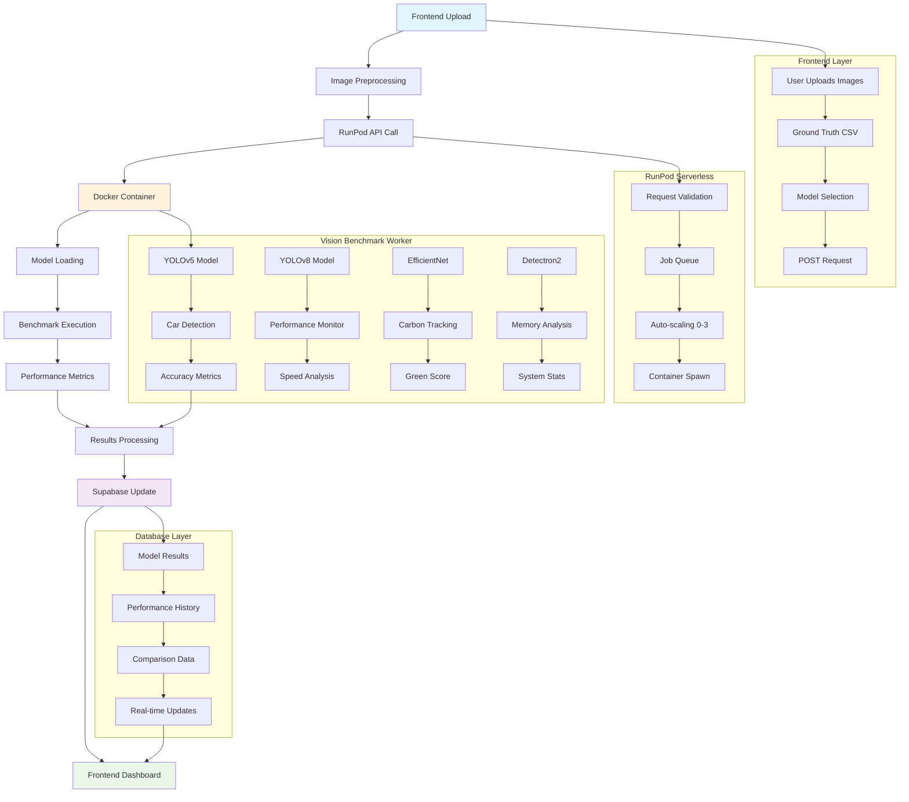
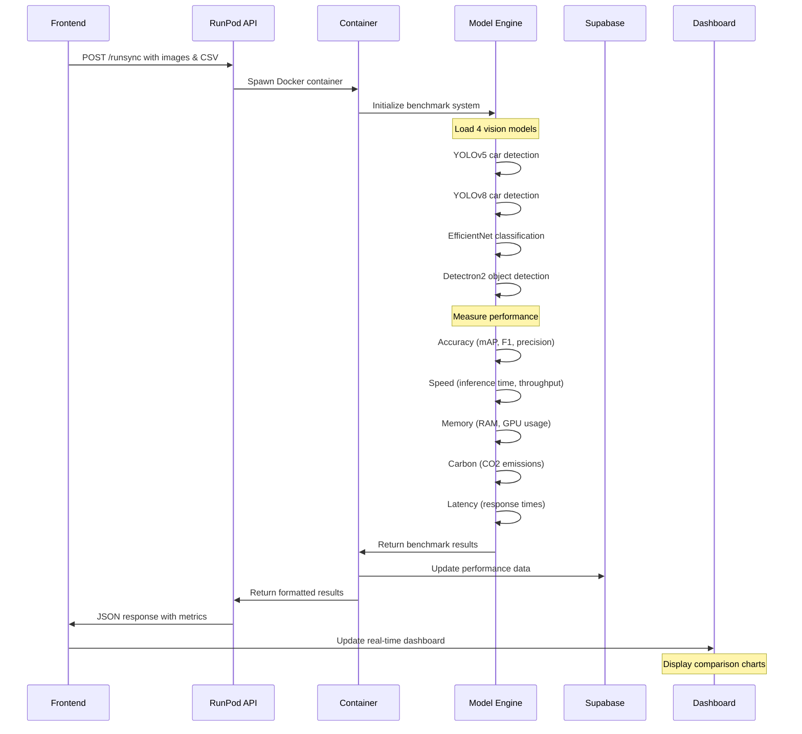
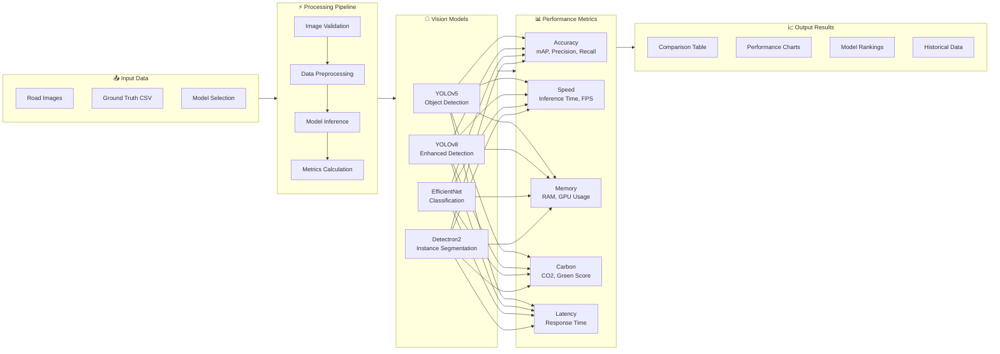
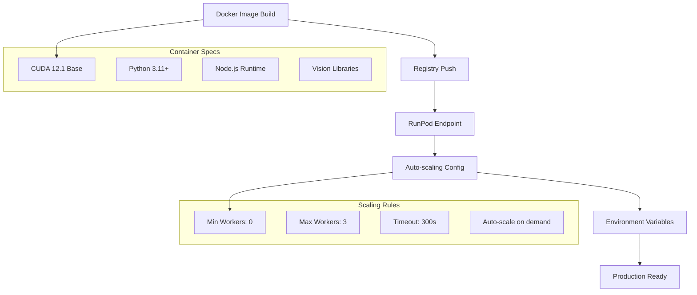
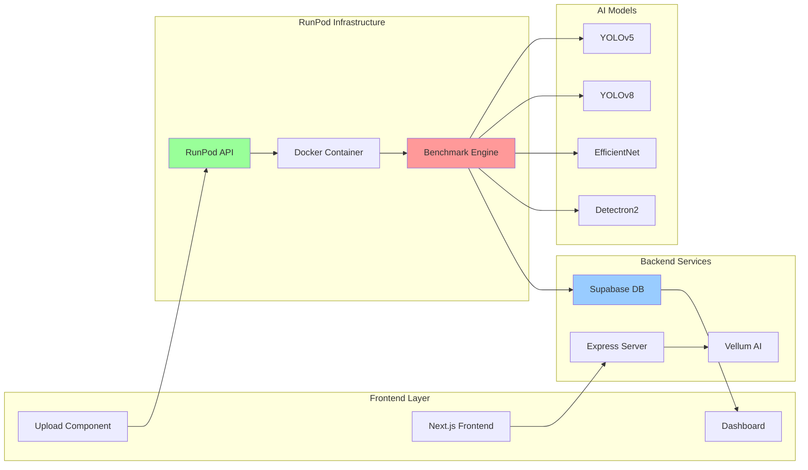
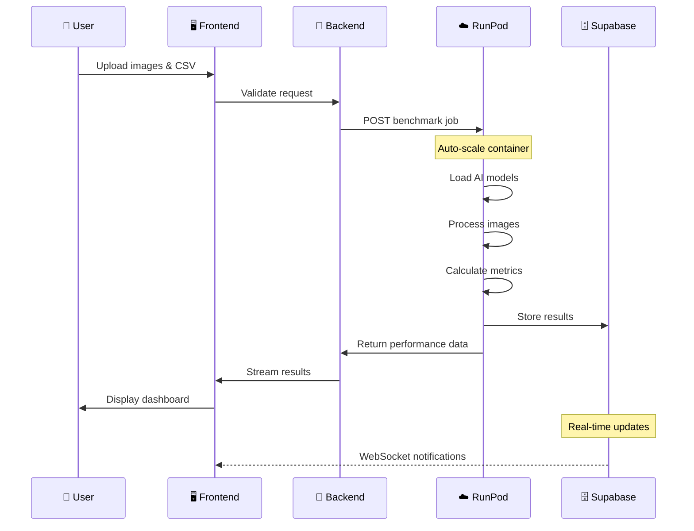

# HackThe6ix Backend - Vision Benchmark System

## 🚀 Vision Model Performance Comparison Platform

A comprehensive backend system that benchmarks computer vision models (YOLOv5, YOLOv8, EfficientNet, Detectron2) on car detection tasks, measuring accuracy, speed, memory usage, carbon footprint, and more.

## 🔄 System Process Flow



## 📊 Detailed Architecture Flow



## 🎯 Data Flow Architecture



## Prerequisites
- Node.js (v14 or higher)
- npm (v6 or higher)
- Git
- Docker Desktop (for RunPod deployment)

## 🔗 RunPod Integration Setup

### RunPod Serverless Configuration


### API Endpoint Structure
```json
{
  "endpoint": "https://api.runpod.ai/v2/YOUR_ENDPOINT_ID/runsync",
  "method": "POST",
  "headers": {
    "Authorization": "Bearer YOUR_RUNPOD_API_KEY",
    "Content-Type": "application/json"
  },
  "body": {
    "input": {
      "images": ["base64_encoded_image_1", "base64_encoded_image_2"],
      "ground_truth_csv": "base64_encoded_csv_data",
      "models": ["yolov5", "yolov8", "efficientnet", "detectron2"],
      "supabase_config": {
        "url": "your_supabase_url_here",
        "key": "your_supabase_anon_key_here"
      }
    }
  }
}
```

## Setup Instructions

1. Clone the repository
```bash
git clone <repository-url>
cd auth0_login
```

2. Create a `.env` file in the root directory with these values:
```properties
REACT_APP_SUPABASE_URL=your_supabase_url_here
REACT_APP_SUPABASE_ANON_KEY=your_supabase_anon_key_here
NODE_ENV=development
PORT=3000
```

3. Install dependencies
```bash
npm install
```

4. Start the development server
```bash
npm run dev
```

## Port Configuration
- Frontend: http://localhost:3000
- Backend: http://localhost:3001

## Common Issues & Solutions

1. Port already in use
```bash
# Windows
netstat -ano | findstr :3000
taskkill /PID <PID> /F

# Mac/Linux
lsof -i :3000
kill -9 <PID>
```

2. Dependencies issues
```bash
# Clear npm cache
npm cache clean --force
# Reinstall dependencies
rm -rf node_modules
npm install
```

3. Database Connection Issues
- Verify your Supabase URL and key in .env
- Check if Supabase service is running
- Ensure your IP is whitelisted in Supabase dashboard

## Project Structure
```
HackThe6ix_BackEnd/
├── runpod/                          # 🚀 RunPod Vision Benchmark System
│   ├── vision_benchmark_worker.py   # Main AI benchmarking engine
│   ├── runpod_integration.js        # RunPod API client
│   ├── test_worker.py              # Comprehensive test suite
│   ├── Dockerfile                  # Container configuration
│   ├── requirements.txt            # Python dependencies
│   ├── package.json               # Node.js dependencies
│   └── helper-docs/               # 📚 Documentation
│       ├── ARCHITECTURE.md
│       ├── QUICK_START.md
│       └── TUTORIAL.md
├── src/                           # 🎨 Frontend Components
│   ├── components/
│   │   ├── LocalServerDashboard.jsx
│   │   └── VellumDashboard.jsx
│   ├── hooks/
│   │   ├── useLocalServerData.js
│   │   └── useVellumData.js
│   └── lib/
│       └── supabase.js           # Supabase client configuration
├── vellum/                       # 🤖 Vellum Integration
│   ├── main.py
│   └── vellum_test.py
├── data/                         # 📊 Performance Data
│   ├── comparison_results.csv
│   ├── public_models.csv
│   └── proprietary_models.csv
├── server.js                     # Express backend server
├── setup-database.js            # Database initialization
└── .env                         # Environment variables
```

## 🔧 Component Interactions



## Available Scripts
- `npm run dev`: Start both frontend and backend
- `npm run client`: Start only frontend  
- `npm run server`: Start only backend
- `npm run build`: Build for production

### 🚀 RunPod Deployment Scripts
- `cd runpod && ./deploy.bat`: Windows deployment script
- `cd runpod && docker build -t vision-benchmark:latest .`: Build container
- `python test_worker.py`: Run comprehensive tests

## 📊 Performance Metrics Collected

The system measures comprehensive performance across multiple dimensions:

### 🎯 Accuracy Metrics
- **mAP (Mean Average Precision)**: Overall detection accuracy
- **Precision**: True positives / (True positives + False positives)  
- **Recall**: True positives / (True positives + False negatives)
- **F1 Score**: Harmonic mean of precision and recall

### ⚡ Speed Metrics  
- **Inference Time**: Time per image processing (ms)
- **Throughput**: Images processed per second (FPS)
- **Latency**: End-to-end response time
- **P95 Latency**: 95th percentile response time

### 💾 Memory Metrics
- **RAM Usage**: System memory consumption (MB)
- **GPU Memory**: CUDA memory utilization (MB)
- **Peak Memory**: Maximum memory during processing

### 🌱 Environmental Metrics
- **CO2 Emissions**: Carbon footprint per inference (kg)
- **Green Score**: Environmental efficiency rating (1-10)
- **Energy Consumption**: Power usage during processing

## 🔄 Real-time Data Flow



## 🚀 Quick Start for Vision Benchmark

### 1. RunPod Setup
```bash
# Navigate to RunPod directory
cd runpod

# Install dependencies
npm install
pip install -r requirements.txt

# Build Docker container
docker build -t vision-benchmark:latest .

# Deploy to RunPod (after pushing to registry)
# Use RunPod dashboard to create serverless endpoint
```

### 2. Environment Configuration
```properties
# .env file
REACT_APP_SUPABASE_URL=your_supabase_url_here
REACT_APP_SUPABASE_ANON_KEY=your_supabase_anon_key_here
RUNPOD_API_KEY=your_runpod_api_key_here
RUNPOD_ENDPOINT_ID=your_deployed_endpoint_id
NODE_ENV=development
PORT=3000
```

### 3. Test the System
```bash
# Run comprehensive tests
cd runpod
python test_worker.py

# Expected output: "🚀💻 ALGORITHM EXECUTED SUCCESSFULLY! 🚀💻"
```

## 🔧 System Requirements

### Local Development
- **Node.js**: v14+ (v22.2.0 confirmed working)
- **Python**: 3.11+ with CUDA support
- **Docker**: Latest version for containerization
- **RAM**: 8GB+ recommended
- **GPU**: NVIDIA GPU with CUDA 12.1+ (for model inference)

### Production (RunPod)
- **Container**: nvidia/cuda:12.1-devel-ubuntu22.04
- **Auto-scaling**: 0-3 workers
- **Timeout**: 300 seconds
- **Memory**: 8GB+ per worker
- **Storage**: 20GB+ for model caching

## 🎯 API Response Format

```json
{
  "status": "success",
  "execution_time": 127.5,
  "timestamp": "2025-07-20T15:30:45Z",
  "results": {
    "yolov5": {
      "accuracy": {
        "map": 0.85,
        "precision": 0.82, 
        "recall": 0.88,
        "f1": 0.85
      },
      "speed": {
        "inference_time": 0.045,
        "throughput": 22.2,
        "latency_p95": 67.8
      },
      "memory": {
        "ram_mb": 1248,
        "gpu_mb": 2100,
        "peak_mb": 2350
      },
      "carbon": {
        "co2_kg": 0.00012,
        "green_score": 8.5
      }
    },
    "yolov8": { /* similar structure */ },
    "efficientnet": { /* similar structure */ },
    "detectron2": { /* similar structure */ }
  },
  "comparison": {
    "best_accuracy": "yolov8",
    "fastest": "yolov5", 
    "most_efficient": "efficientnet",
    "greenest": "efficientnet"
  }
}
```

## 📞 Support & Documentation

### 🔗 Key Resources
- **RunPod Dashboard**: https://runpod.io
- **Supabase Console**: https://supabase.com/dashboard
- **Docker Hub**: For container registry
- **GitHub Repository**: Source code and issues

### 🛠️ Troubleshooting
- **Container Issues**: Check `runpod/DEPLOYMENT_READY.md`
- **Model Errors**: Review `runpod/helper-docs/`
- **API Problems**: Verify RunPod endpoint configuration
- **Database Issues**: Check Supabase connection strings

### 📧 Contact Information
Contact team lead for access to:
- RunPod API credentials
- Supabase dashboard access
- Docker registry permissions
- Production environment keys

## 🔒 Security Notes
- Never commit .env file
- Keep Supabase keys private
- Use proper authentication
