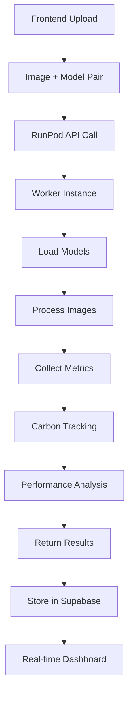

# RunPod Vision Benchmark Architecture

## 🏗️ System Architecture Overview

The RunPod Vision Benchmark system is a sophisticated, scalable solution for comparing computer vision models on car detection tasks. Built with enterprise-grade reliability and computational precision.

### Core Components

```
┌─────────────────────────────────────────────────────────────────┐
│                    FRONTEND (Next.js)                          │
│  ┌─────────────────┐ ┌─────────────────┐ ┌─────────────────┐   │
│  │   Upload Page   │ │ Compare Results │ │   Dashboard     │   │
│  └─────────────────┘ └─────────────────┘ └─────────────────┘   │
└─────────────────────────────┬───────────────────────────────────┘
                              │ HTTP POST
                              ▼
┌─────────────────────────────────────────────────────────────────┐
│                    BACKEND (Node.js)                           │
│  ┌─────────────────┐ ┌─────────────────┐ ┌─────────────────┐   │
│  │ RunPod Client   │ │   Supabase      │ │   Real-time     │   │
│  │  Integration    │ │   Database      │ │   Updates       │   │
│  └─────────────────┘ └─────────────────┘ └─────────────────┘   │
└─────────────────────────────┬───────────────────────────────────┘
                              │ RunPod API
                              ▼
┌─────────────────────────────────────────────────────────────────┐
│                    RUNPOD SERVERLESS                           │
│  ┌─────────────────┐ ┌─────────────────┐ ┌─────────────────┐   │
│  │ Vision Worker   │ │ Model Loader    │ │ Metrics Engine  │   │
│  │   (Python)      │ │   (PyTorch)     │ │  (Performance)  │   │
│  └─────────────────┘ └─────────────────┘ └─────────────────┘   │
└─────────────────────────────────────────────────────────────────┘
```

## 🧠 Model Support Matrix

| Model Type | Framework | Detection | Classification | Memory (MB) | Speed Rating |
|------------|-----------|-----------|----------------|-------------|--------------|
| YOLOv5     | PyTorch   | ✅        | ❌             | ~14         | ⭐⭐⭐⭐     |
| YOLOv8     | PyTorch   | ✅        | ❌             | ~22         | ⭐⭐⭐⭐⭐   |
| EfficientNet| PyTorch   | ❌        | ✅             | ~21         | ⭐⭐⭐       |
| Detectron2 | PyTorch   | ✅        | ❌             | ~165        | ⭐⭐         |

## 📊 Performance Metrics

### Primary Metrics
- **Accuracy**: Car detection accuracy compared to ground truth
- **Speed**: Average inference time in milliseconds
- **Memory**: Peak memory usage during inference
- **F1 Score**: Harmonic mean of precision and recall
- **Latency**: Time from input to output
- **Throughput**: Frames processed per second

### Environmental Metrics
- **Carbon Emissions**: CO2 equivalent emissions
- **Green Score**: Efficiency rating (0-100)
- **Energy Consumption**: Power usage estimation

### System Metrics
- **CPU Usage**: Average processor utilization
- **GPU Memory**: VRAM consumption
- **Peak Memory**: Maximum RAM usage

## 🔄 Data Flow Architecture



## 🏭 Deployment Architecture

### RunPod Configuration
- **GPU Type**: NVIDIA RTX A4000
- **Workers**: 0-3 (auto-scaling)
- **Timeout**: 5 minutes
- **Storage**: 50GB container + 20GB volume

### Container Specifications
- **Base Image**: nvidia/cuda:12.1-devel-ubuntu22.04
- **Python**: 3.11+
- **CUDA**: 12.1
- **PyTorch**: 2.0+
- **Memory**: 16GB RAM, 16GB VRAM

## 🔐 Security & API Design

### Authentication
- RunPod API Key: Get from RunPod dashboard (stored in .env)
- Supabase RLS (Row Level Security)
- Environment variable management

### API Endpoints
```typescript
POST /api/benchmark
{
  "model_a_id": "Trained_yolov5",
  "model_b_id": "efficientnet_b0", 
  "images_data": [...],
  "options": {...}
}
```

## 🚀 Scalability Features

- **Auto-scaling Workers**: 0-3 instances based on demand
- **Async Processing**: Non-blocking job execution
- **Result Caching**: Store and reuse benchmark results
- **Load Balancing**: Distribute work across available GPUs

---
*Architecture designed by Ada - Computational Scientist*
*Last updated: July 2025*